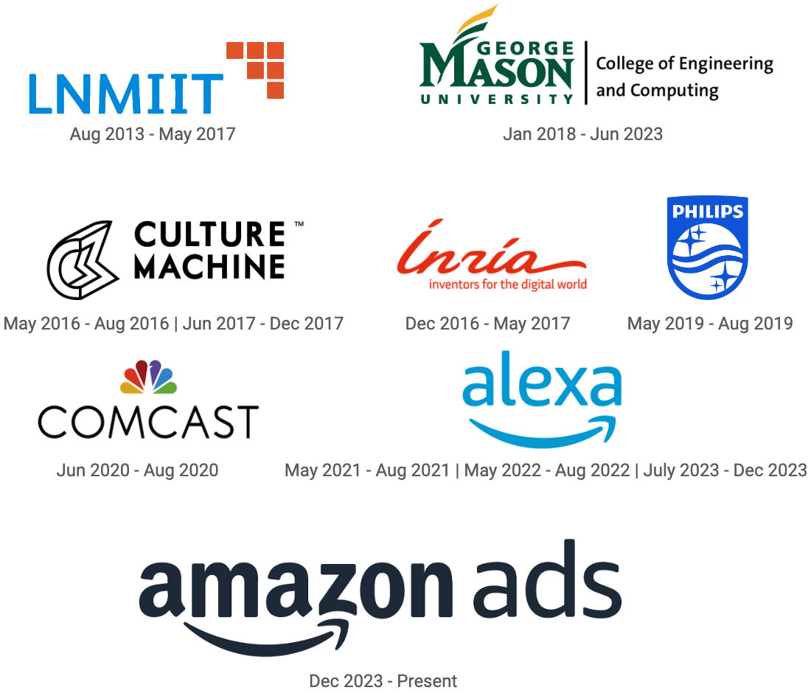

**[Home\>\>](./)[Publications](./publications.html)**
## Publications :

#### [View Google Scholar](https://scholar.google.com/citations?user=fKMSzz0AAAAJ){:target="_blank"}

#### Book Chapter
* [Intent Mining for the Good, Bad & Ugly Use of Social Web: Concepts, Methods, and Challenges](http://ist.gmu.edu/~hpurohit/informatics-lab/papers/snam-chapter-intent-FINAL.pdf)

	Hemant Purohit and **Rahul Pandey**. 2019. In Emerging Research Challenges and Opportunities in Computational Social Network Analysis and Mining, Springer.

	[\[Springer\]](https://doi.org/10.1007/978-3-319-94105-9_1){:target="_blank"}

#### Conference Paper
* [Modeling Human Annotation Errors to Design Bias-Aware Systems for Social Stream Processing](https://arxiv.org/pdf/1907.07228.pdf){:target="_blank"}

	**Rahul Pandey**, Carlos Castillo, Hemant Purohit. 2019. In Proceedings of 2018 IEEE/ACM International Conference on Advances in Social Networks Analysis and Mining (ASONAM).  

	[\[arXiv\]](https://arxiv.org/abs/1907.07228){:target="_blank"}

* [EMAssistant: A Learning Analytics System for Social and Web Data Filtering to Assist Trainees and Volunteers of Emergency Services](http://idl.iscram.org/files/rahulpandey/2019/1795_RahulPandey_etal2019.pdf)

	**Rahul Pandey**, Gaurav Bahl, Hemant Purohit. 2019. In Proceedings of 17th International Conference on Information Systems for Crisis Response and Management (ISCRAM).

	[\[ISCRAM Digital Library\]](http://idl.iscram.org/show.php?record=1795){:target="_blank"}

* [Distributional Semantics Approach to Detect Intent in Twitter Conversations on Sexual Assaults](https://arxiv.org/pdf/1810.01012.pdf){:target="_blank"}

	**Rahul Pandey**, Hemant Purohit, Bonnie Stabile, Aubrey Grant. 2018. In Proceedings of 2018 IEEE/WIC/ACM International Conference on Web Intelligence (WI’18).

	**🏆_Best Paper Award_ 🏆**

	[\[IEEE Xplore\]](https://doi.org/10.1109/WI.2018.00-80){:target="_blank"}

* [Ranking of Social Media Alerts with Workload Bounds in Emergency Operation Centers](https://arxiv.org/pdf/1809.08489.pdf){:target="_blank"}

	Hemant Purohit, Carlos Castillo, Muhammad Imran, **Rahul Pandey**. 2018. In Proceedings of 2018 IEEE/WIC/ACM International Conference on Web Intelligence (WI’18).

	[\[IEEE Xplore\]](https://doi.org/10.1109/WI.2018.00-88){:target="_blank"}

* [Social-EOC: Serviceability Model to Rank Social Media Requests for Emergency Operation Centers](http://chato.cl/papers/purohit_castillo_imran_pandey_2018_social_eoc_social_media_emergency_operation_center.pdf){:target="_blank"}

	Hemant Purohit, Carlos Castillo, Muhammad Imran, **Rahul Pandey**. 2018. In Proceedings of 2018 IEEE/ACM International Conference on Advances in Social Networks Analysis and Mining (ASONAM).  

	[\[IEEE Xplore\]](https://doi.org/10.1109/ASONAM.2018.8508709){:target="_blank"}

#### Demo Paper
* [CitizenHelper-Adaptive : Expert-augmented Streaming Analytics System for Emergency Services and Humanitarian Organizations](https://www.researchgate.net/profile/Hemant_Purohit2/publication/327848833_CitizenHelper-Adaptive_Expert-augmented_Streaming_Analytics_System_for_Emergency_Services_and_Humanitarian_Organizations/links/5ba9729945851574f7e3f7f4/CitizenHelper-Adaptive-Expert-augmented-Streaming-Analytics-System-for-Emergency-Services-and-Humanitarian-Organizations.pdf){:target="_blank"}

	**Rahul Pandey** and Hemant Purohit. 2018. In Proceedings of 2018 IEEE/ACM International Conference on Advances in Social Networks Analysis and Mining (ASONAM).

	[\[IEEE Xplore\]](https://doi.org/10.1109/ASONAM.2018.8508374){:target="_blank"}

#### Workshop/Symposium Paper
* [(To appear) BoostER: A Performance Boosting Module for Biomedical Entity Recognition](./publications.html)

	**Rahul Pandey** et al. 2019. In Proceedings of Second Workshop in Artificial Intelligence Techniques for BioMedicine and HealthCare (AIBH) co-located with IEEE BIBM 2019.

* [Classifying Relevant Social Media Posts During Disasters Using Ensemble of Domain-agnostic and Domain-specific Word Embeddings](https://arxiv.org/pdf/1911.05165.pdf)

	Ganesh Nalluru, **Rahul Pandey**, and Hemant Purohit. 2019. In Proceedings of AAAI 2019 FALL SYMPOSIUM SERIES.

	[\[arxiv\]](https://arxiv.org/abs/1911.05165){:target="_blank"}

* [Relevancy Classification of Multimodal Social Media Streams for Emergency Services](https://arxiv.org/pdf/1907.07240.pdf)

	Ganesh Nalluru, **Rahul Pandey**, and Hemant Purohit. 2019. In Proceedings of the Fourth IEEE Workshop on Smart Service Systems co-located with SMARTCOMP 2019.

	[\[IEEE Xplore\]](https://doi.org/10.1109/SMARTCOMP.2019.00040){:target="_blank"}

* [AI for Trustworthiness! Credible User Identification on Social Web for Disaster Response Agencies](https://arxiv.org/pdf/1810.01013.pdf){:target="_blank"}

	**Rahul Pandey**, Hemant Purohit, Jennifer Chan, Aditya Johri. 2018. In Proceedings of AAAI 2018 FALL SYMPOSIUM SERIES.

	[\[arXiv\]](https://arxiv.org/abs/1810.01013){:target="_blank"}

* [Generic architecture of a social media-driven intervention support system for smart cities.](https://mason.gmu.edu/~rpandey4/scc18-gbv-social.pdf){:target="_blank"}

	**Rahul Pandey** and Hemant Purohit. 2018. In Proceedings of the Workshop Program of the 19th International Conference on Distributed Computing and Networking (Workshops ICDCN '18).

	[\[ACM Digital Library\]](https://doi.org/10.1145/3170521.3170528){:target="_blank"}

#### Extended Abstract
* [Modeling Policy-relevant Intent related to Gender Violence Myths on Social Media using Social Construction Theory](http://mason.gmu.edu/~rpandey4/modeling-gbv-policy-intent-ic2s218.pdf){:target="_blank"}

	Hemant Purohit, Bonnie Stabile, Aubrey Grant, **Rahul Pandey**. 2018. in 4th International Conference on Computational Social Science (IC2S2).

[back](./)
* * *

